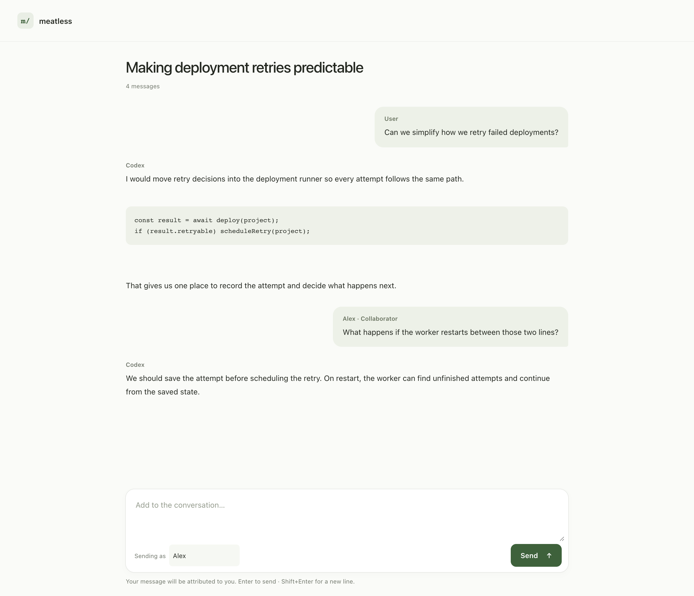

# meatless

Share one local Codex or Claude Code conversation through a small web chat.

The first version uses Node.js, plain browser JavaScript, and Cloudflare Tunnel.
Guests can read the selected conversation. Enable writing to let them send
messages with their name attached. An optional passphrase protects access.



Example conversation with collaborator messages enabled.

## Run it

Requires Node.js 24+, an installed and authenticated `codex` or `claude` CLI,
and `cloudflared` when using `--tunnel`.

```sh
brew install cloudflared

# Paste a Codex desktop deep link. Starts the tunnel automatically.
npx meatless codex://threads/<session-id>

# Add a passphrase, or allow messages.
npx meatless codex://threads/<session-id> --passphrase
npx meatless codex://threads/<session-id> --write --passphrase

# Find an existing conversation.
npm start -- list codex
npm start -- list claude

# Share a conversation for reading, with a passphrase.
npm start -- codex <session-id> --passphrase --tunnel
npm start -- claude <session-id> --passphrase --tunnel

# Let collaborators contribute.
npm start -- codex <session-id> --write --passphrase --tunnel
npm start -- claude <session-id> --write --passphrase --tunnel

# Or start a new shared conversation in a project.
npm start -- codex new --cwd /path/to/project --write --passphrase --tunnel
npm start -- claude new --cwd /path/to/project --write --passphrase --tunnel
```

For local development, run `npm install` and `npm link` in this checkout.
This registers the `meatless` command locally. The `npm start` examples
require running from the checkout.

Deep links are read-only by default and automatically start a tunnel.
Use `--local` to share only on localhost. Commands using `npm start` need the
`--` separator shown above, so npm forwards flags such as `--tunnel`.

`--passphrase` prompts without echoing the passphrase. Omit it for access by
anyone with the URL. For non-interactive use, set `MEATLESS_PASSPHRASE`.
Passphrases stay in memory; authenticated browsers get a session cookie.
Names are self-reported labels. Everyone with access has the same permissions.

The command prints a local URL and, for deep links or `--tunnel`, a temporary public URL.
The tunnel uses HTTP/2; the chat streams updates over WebSockets.
Use `--local` to try the interface without a public URL. The default port
is 8787; override it with `--port`. Stop with Ctrl+C to end sharing. The laptop
and sharing process must stay running.

## Codex

Read-only sharing watches the selected session's saved JSONL transcript
without resuming it or starting another Codex runtime. New saved messages
appear automatically while you keep working in the desktop app.
With `--write`, the command resumes the conversation in its own app-server.
Use the shared web page while sharing; continuing the same thread in the
original desktop window or terminal would create two independent runtimes.
Command and file-change approval requests appear in the sharing terminal.
Unsupported approval types are declined. Existing sandbox settings still apply.
The model comes from your Codex configuration; use `--model <name>` to override
it for the shared session.

To share one running app-server with a terminal and the web page, start it
explicitly on localhost:

```sh
codex app-server --listen ws://127.0.0.1:4500

# In another terminal, work against that server.
codex --remote ws://127.0.0.1:4500

# Get the session ID, then connect the shared page to the same server.
npm start -- list codex --connect ws://127.0.0.1:4500
npm start -- codex <session-id> --connect ws://127.0.0.1:4500 --write --passphrase --tunnel
```

Only the sharing server goes through the tunnel. Keep the raw app-server
listener on localhost. Attaching directly to the desktop app's internal
runtime has not been verified. Codex's app-server interface is experimental.

## Claude Code

Read-only sharing watches the selected transcript while you keep working in
Claude. With `--write`, close the original Claude session first. The command
resumes it with an MCP channel, keeping the regular interactive terminal for
you and its tool approvals. The channel's `reply` tool sends answers to the
web page and is the only tool this project adds to the allowlist.

Claude will ask you to accept the custom development channel at startup.
Channels are a research preview and may require organization enablement.
If Claude reports that channels are unavailable, guest messages will not
arrive even though the MCP server is connected. Check the startup notice.
This version does not claim delivery confirmation for channel notifications.

## Scope

- One selected conversation per process. Session listing is available only
  through the local CLI.
- Guest messages include their name and a collaborator label.
- Codex sends one turn at a time. Claude queues channel messages itself.
- The page shows user and assistant text, including Claude channel replies.
  Reasoning, command outputs, and tool results are omitted.
- No database or hosted backend. Codex and Claude retain their own transcripts.
- No attachments, account system, or session branching.

```sh
npm test
```

The tests exercise access control, WebSocket updates, Codex JSON-RPC streaming,
transcript filtering, and the Claude channel over a real MCP transport,
without calling a model.

Protocol references: [Codex app-server](https://learn.chatgpt.com/docs/app-server),
[Claude channels](https://code.claude.com/docs/en/channels-reference),
[Cloudflare Quick Tunnels](https://developers.cloudflare.com/tunnel/get-started/quick-tunnels/).
